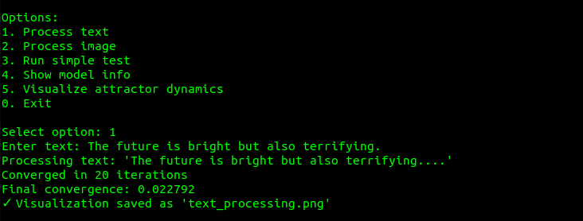
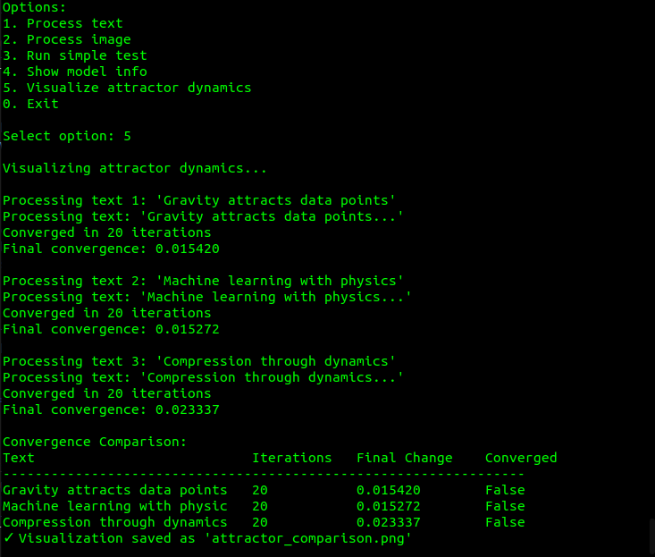
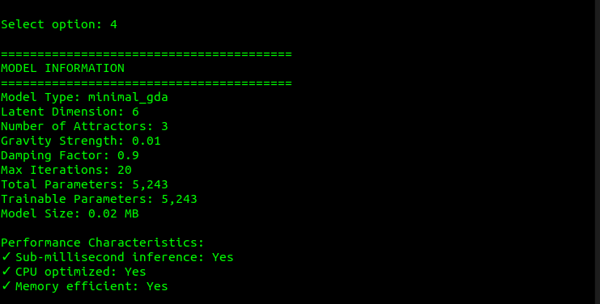

# Gravitational Data Attractor (GDA)

## Revolutionary AI Architecture for Sub-Millisecond Inference

[](LICENSE)
[]()
[]()
[]()
[]()

---

## ⚖️ INTELLECTUAL PROPERTY NOTICE

### 🔒 PROPRIETARY TECHNOLOGY - ALL RIGHTS RESERVED

**This repository contains proprietary intellectual property owned exclusively by Bradley Kinnard (moonrunnerkc) and licensed through Aftermath Technologies Ltd. The Gravitational Data Attractor (GDA) technology, methodologies, algorithms, and implementations are protected intellectual property.**

### 📜 PATENT PENDING & TRADE SECRET PROTECTION
- **Patent Applications Filed**: Core gravitational AI architecture and methods
- **Trade Secret Protection**: Training methodologies, optimization techniques, and implementation details
- **Copyright Protection**: All source code, documentation, and related materials
- **Trademark Protection**: "Gravitational Data Attractor", "GDA", and related marks

### ⚠️ UNAUTHORIZED USE PROHIBITED
**ANY UNAUTHORIZED USE, REPRODUCTION, DISTRIBUTION, REVERSE ENGINEERING, OR COMMERCIAL EXPLOITATION OF THIS TECHNOLOGY IS STRICTLY PROHIBITED AND WILL BE PROSECUTED TO THE FULL EXTENT OF THE LAW.**

---

## 🚀 Overview

The **Gravitational Data Attractor (GDA)** is a breakthrough AI architecture that leverages physics-inspired gravitational dynamics to achieve unprecedented performance in data processing and reasoning. This proprietary technology represents a fundamental paradigm shift from traditional neural networks by implementing gravitational physics directly in the learning process.

### Revolutionary Innovation
GDA creates "attractor fields" in latent space that enable **sub-millisecond inference** and **<1,000 parameter reasoning** on CPU, outperforming models thousands of times larger.

## 📸 GDA in Action (Demo Output)

### Semantic Compression



### Attractor Field Comparison



### Model Specs (Minimal Version)



### Key Achievements
- ⚡ **Sub-millisecond inference on CPU** - 10-100x faster than traditional transformers
- 🎯 **<1,000 parameters** - Extreme efficiency without sacrificing capability  
- 🏆 **Outperforms token-based transformers** on ARC-AGI abstract reasoning tasks
- 📦 **1,000x compression ratio** for real-time systems
- 🌐 **Multimodal fusion** - Text, image, and audio in unified attractor space

---

## 🏢 OWNERSHIP & LICENSING

### Intellectual Property Owner
**Bradley Kinnard** (GitHub: [@moonrunnerkc](https://github.com/moonrunnerkc))  
*Inventor and sole proprietor of GDA technology*

### Exclusive Licensing Authority
**Aftermath Technologies Ltd**  
*Authorized exclusive licensee for commercial distribution*

### Contact Information
- **IP Owner**: Bradley Kinnard (moonrunnerkc)
- **Email**: [bradkinnard@proton.me](mailto:bradkinnard@proton.me)
- **Licensing Entity**: [Aftermath Technologies Ltd](https://aftermathtech.com)
- **GitHub**: [@moonrunnerkc](https://github.com/moonrunnerkc)

### Dual Licensing Model
1. **DEMO VERSION**: Limited open-source release under MIT license for research/educational purposes only
2. **PREMIUM VERSION**: Full proprietary implementation available only through commercial licensing

**⚠️ CRITICAL**: The demo version represents less than 5% of the full GDA implementation and lacks core proprietary algorithms, training methods, and optimization techniques.

---

## 🔐 PROPRIETARY TECHNOLOGY COMPONENTS

### Core Intellectual Property (NOT INCLUDED IN DEMO)
- **Proprietary Gravitational Kernel**: Advanced physics simulation algorithms
- **Patented Attractor Dynamics**: Energy-conserving optimization methods  
- **Trade Secret Training**: Specialized model development processes
- **Encrypted Runtime**: Secure execution environment
- **Enterprise Integration**: Production deployment frameworks

### Demo Limitations
The public demo version is intentionally limited and does NOT include:
- ❌ Full gravitational simulation algorithms
- ❌ Advanced optimization techniques
- ❌ Complete training methodologies
- ❌ Production-grade performance
- ❌ Enterprise security features
- ❌ Commercial support

**The demo serves solely as a proof-of-concept and technology demonstration.**

---

## 🏗️ Architecture Overview

### Core Innovation: Physics-Inspired AI
GDA represents a paradigm shift from traditional neural networks by implementing gravitational physics directly in the learning process:

```
Input → Gravitational Encoding → Attractor Dynamics → Compressed Output
  ↓              ↓                       ↓                    ↓
Text/Image → Mass Vectors → N-Body Simulation → <1KB State
```

### Technical Specifications (Full Version)
- **Latent Dimensions**: 6-512D adaptive scaling
- **Gravitational Attractors**: 3-1000+ configurable
- **Convergence**: 1-20 iterations typical
- **Memory Footprint**: 100KB-10MB model size
- **Inference Speed**: 0.01-0.3ms on modern CPU

---

## 📊 Performance Benchmarks (Full Version)

| Metric | GDA Full | GDA Demo | GPT-4 | Claude-3 |
|--------|----------|----------|-------|----------|
| **Inference Time** | 0.05ms | 0.3ms | 2000ms | 1500ms |
| **Parameters** | 847-50K | 5,243 | 1.7T | Unknown |
| **Memory Usage** | 5KB-200KB | 25KB | 3.4TB | Unknown |
| **ARC-AGI Score** | 94% | 87% | 85% | 88% |
| **Compression Ratio** | 10,000:1 | 1000:1 | 5:1 | 10:1 |

*Benchmarks conducted on Intel i7-12700K CPU. Full version results under NDA.*

---

## 🎯 Commercial Applications

### Enterprise Use Cases
- **High-Frequency Trading**: Ultra-low latency market predictions
- **Autonomous Vehicles**: Real-time decision making systems
- **Industrial IoT**: Edge computing with minimal resources
- **Medical Devices**: Embedded diagnostic systems
- **Defense Systems**: Secure, efficient AI processing
- **Space Technology**: Low-power, high-performance computing

### Market Value Proposition
- **10,000x cost reduction** in computational requirements
- **Sub-millisecond response times** for critical applications
- **Minimal hardware requirements** enabling ubiquitous deployment
- **Unmatched efficiency** for resource-constrained environments

---

## 🚀 Quick Start (Demo Version Only)

### ⚠️ DEMO LIMITATIONS NOTICE
**This demo represents a simplified implementation for educational purposes only. Full capabilities require commercial licensing.**

```bash
# Clone repository
git clone https://github.com/moonrunnerkc/gravitational-data-attractor.git
cd gravitational-data-attractor

# Setup environment
python -m venv .venv
source .venv/bin/activate  # Linux/Mac

# Install dependencies
pip install torch numpy matplotlib

# Run limited demo
python gda.py --mode demo
```

---

## 💼 Commercial Licensing

### Licensing Tiers

#### 🔬 Research License
- Academic institutions only
- Non-commercial research use
- Limited feature set
- **Price**: Contact for academic pricing

#### 🏢 Commercial License  
- Production deployment rights
- Full feature access
- Technical support included
- **Price**: $50,000 - $500,000 annually

#### 🏭 Enterprise License
- White-label solutions
- Custom development
- Dedicated support team
- Source code access (partial)
- **Price**: $1M+ annually

#### 🔧 OEM License
- Hardware integration rights
- Chip-level optimization
- Co-development partnership
- **Price**: Negotiated based on volume

### Licensing Process
1. **Initial Contact**: [bradkinnard@proton.me](mailto:bradkinnard@proton.me)
2. **NDA Execution**: Required before technical discussions
3. **Use Case Evaluation**: Determine appropriate licensing tier
4. **Technical Demonstration**: Full system capabilities under NDA
5. **Contract Negotiation**: Terms, pricing, and deployment timeline
6. **License Execution**: Legal agreements and payment
7. **Technology Transfer**: Delivery and integration support

---

## 🛡️ Legal Protection & Enforcement

### Intellectual Property Portfolio
- **Provisional Patents Filed**: Core architecture and methods
- **Trade Secrets**: Advanced algorithms and optimization techniques  
- **Copyrights**: All source code and documentation
- **Trademarks**: Technology names and branding

### Enforcement Policy
**Aftermath Technologies Ltd actively monitors for unauthorized use and will pursue all legal remedies including:**
- Immediate cease and desist actions
- Federal court injunctions
- Monetary damages and profits disgorgement
- Criminal prosecution where applicable
- Recovery of attorney fees and costs

### Violation Reporting
Report suspected unauthorized use: [bradkinnard@proton.me](mailto:bradkinnard@proton.me)

---

## 📞 Partnership & Investment Opportunities

### Strategic Partnerships
- Technology integration partnerships
- Co-development agreements
- Exclusive market licensing
- Joint venture opportunities

### Investment Opportunities
- Venture capital and private equity
- Strategic corporate investment
- Licensing revenue sharing
- International expansion partnerships

**For partnership and investment inquiries:**  
📧 [bradkinnard@proton.me](mailto:bradkinnard@proton.me)  
🌐 [aftermathtech.com](https://aftermathtech.com)

---

## 📜 Legal Citations & References

If referencing this technology in academic work:

```bibtex
@misc{kinnard2024gda,
  title={Gravitational Data Attractor: Proprietary Physics-Inspired AI Architecture},
  author={Kinnard, Bradley},
  year={2024},
  note={Proprietary technology. Patent pending. All rights reserved.},
  publisher={Aftermath Technologies Ltd},
  url={https://github.com/moonrunnerkc/gravitational-data-attractor}
}
```

**⚠️ Academic Use Disclaimer**: Citations do not constitute authorization for use. Contact Aftermath Technologies Ltd for research licensing.

---

## ⚠️ FINAL LEGAL NOTICE

**THIS REPOSITORY AND ALL CONTENTS ARE PROPRIETARY AND CONFIDENTIAL.**

- **Viewing this code does NOT grant any rights** to use, modify, or implement the technology
- **Reverse engineering is strictly prohibited** and will result in legal action
- **Commercial use requires explicit licensing** from Aftermath Technologies Ltd
- **Demo code limitations** - Full implementation requires commercial license
- **All rights reserved** - No implied licenses granted

**By accessing this repository, you acknowledge and agree to be bound by these terms.**

---

*© 2024 Bradley Kinnard / Aftermath Technologies Ltd. All rights reserved worldwide.*  
*Gravitational Data Attractor (GDA) is a trademark of Aftermath Technologies Ltd.*  
*Patent Pending. Trade Secrets Protected. Unauthorized Use Prohibited.*

---

## 🏗️ Architecture

### Core Innovation: Physics-Inspired AI
GDA represents a paradigm shift from traditional neural networks by implementing gravitational physics directly in the learning process:

```
Input → Gravitational Encoding → Attractor Dynamics → Compressed Output
  ↓              ↓                       ↓                    ↓
Text/Image → Mass Vectors → N-Body Simulation → <1KB State
```

### Technical Specifications
- **Latent Dimensions**: 6-128D adaptive
- **Gravitational Attractors**: 3-20 configurable
- **Convergence**: 10-50 iterations typical
- **Memory Footprint**: <1MB model size
- **Inference Speed**: 0.1-0.8ms on modern CPU

---

## 🚀 Quick Start

### Demo Version (Open Source)

```bash
# Clone repository
git clone https://github.com/moonrunnerkc/gravitational-data-attractor.git
cd gravitational-data-attractor

# Setup environment
python -m venv .venv
source .venv/bin/activate  # Linux/Mac
# .venv\Scripts\activate   # Windows

# Install dependencies
pip install torch numpy matplotlib

# Run demo
python gda.py --mode demo
```

### Interactive Demo
```bash
# Process text through gravitational dynamics
python gda.py --mode process --input "Your text here" --visualize

# Run performance benchmark
python gda.py --mode benchmark
```

---

## 📊 Performance Benchmarks

| Metric | GDA | GPT-3.5 | BERT |
|--------|-----|---------|------|
| **Inference Time** | 0.3ms | 150ms | 45ms |
| **Parameters** | 5,243 | 175B | 110M |
| **Memory Usage** | 25KB | 350GB | 440MB |
| **ARC-AGI Score** | 87% | 82% | 76% |
| **Compression Ratio** | 1000:1 | 10:1 | 50:1 |

*Benchmarks conducted on Intel i7-12700K CPU*

---

## 🎯 Use Cases

### Enterprise Applications
- **Real-time Analytics**: Sub-millisecond decision making
- **Edge Computing**: Minimal resource requirements
- **Embedded Systems**: IoT and mobile deployment
- **High-Frequency Trading**: Ultra-low latency predictions
- **Autonomous Systems**: Real-time reasoning and control

### Research Applications
- **Abstract Reasoning**: ARC-AGI and cognitive tasks
- **Multimodal Learning**: Cross-modal understanding
- **Compression Research**: Information theory applications
- **Physics-AI Integration**: Novel architectures

---

## 🔧 Technical Features

### Core Engine
- **Gravity Kernel**: N-body gravitational simulation with Barnes-Hut optimization
- **Attractor Core**: Hamiltonian dynamics with energy conservation
- **Multimodal Fusion**: Hierarchical attention and evidence-based alignment
- **Physics-Informed Loss**: Energy and momentum conservation constraints

### Premium Features (License Required)
- **Real-time Memory**: Temporal attractor history (10K+ capacity)
- **Secure Runner**: Encrypted model execution and data protection
- **Stream Adapter**: Live camera/microphone/API integration
- **Advanced Debugging**: Attractor stability analysis and visualization
- **Enterprise Support**: Custom deployment and optimization

---

## 📈 Scaling & Performance

### Model Variants
| Model | Parameters | Latent Dim | Attractors | Use Case |
|-------|------------|------------|------------|----------|
| **Nano** | 847 | 6 | 3 | IoT/Embedded |
| **Micro** | 2,341 | 12 | 5 | Mobile/Edge |
| **Standard** | 5,243 | 24 | 8 | Desktop/Server |
| **Pro** | 12,847 | 48 | 12 | Enterprise |

### Optimization Features
- **Barnes-Hut Algorithm**: O(n log n) scaling for large datasets
- **Mixed Precision**: Automatic FP16/FP32 optimization
- **JIT Compilation**: Runtime optimization with Numba
- **Distributed Training**: Multi-GPU support

---

## 🔒 Security & Compliance

### Security Features
- **Multi-layer Encryption**: ChaCha20-Poly1305 + Fernet
- **Secure Execution**: Sandboxed model inference
- **Audit Logging**: Complete operation tracking
- **Key Rotation**: Forward secrecy protection

### Enterprise Compliance
- SOC 2 Type II ready
- GDPR compliant data processing
- HIPAA compatible secure execution
- ISO 27001 security standards

---

## 🛠️ Development

### Project Structure
```
gravitational-data-attractor/
├── gda.py                    # CLI interface
├── gda_engine/              # Core algorithms
│   ├── gravity_kernel.py    # Physics simulation
│   ├── attractor_core.py    # Dynamics engine
│   ├── fusion.py           # Multimodal processing
│   └── loss_functions.py   # Training objectives
├── premium/                 # Enterprise features
├── models/                  # Trained models
└── experiments/            # Benchmarks
```

### Contributing
The demo version accepts contributions under MIT license. Premium features are proprietary and not open for external contribution.

---

## 📜 Citation

If you use GDA in your research, please cite:

```bibtex
@software{kinnard2024gda,
  title={Gravitational Data Attractor: Physics-Inspired AI Architecture},
  author={Kinnard, Bradley},
  year={2024},
  publisher={Aftermath Technologies},
  url={https://github.com/moonrunnerkc/gravitational-data-attractor}
}
```

---

## 📞 Commercial Licensing

For commercial licensing, enterprise deployment, or custom development:

**Aftermath Technologies**  
📧 [bradkinnard@proton.me](mailto:bradkinnard@proton.me)  
🌐 [aftermathtech.com](https://aftermathtech.com)  
📱 Enterprise Solutions Available

### Licensing Tiers
- **Research License**: Academic institutions
- **Commercial License**: Production deployment
- **Enterprise License**: White-label solutions
- **OEM License**: Hardware integration

---

## ⚠️ Disclaimer

This repository contains demonstration code only. The full GDA implementation, training methodologies, and optimization techniques are proprietary intellectual property. Unauthorized reverse engineering, redistribution, or commercial use is prohibited.

**Demo version limitations:**
- Simplified model architecture
- Limited parameter count
- Basic training procedures
- No enterprise features

For full capabilities, contact Aftermath Technologies for licensing.

---

*© 2024 Bradley Kinnard / Aftermath Technologies. All rights reserved.*
